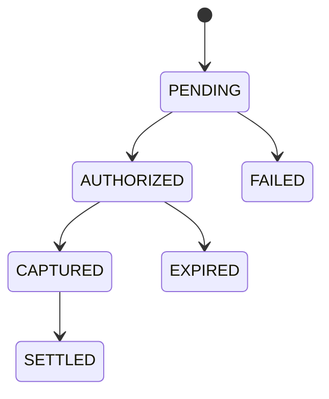

# PayCore

PayCore is a production-inspired payment gateway and settlement engine built as a Go backend systems project.

The long-term goal is to model high-throughput payment infrastructure with idempotent payment authorization and capture, Redis-backed admission control, PostgreSQL-backed durable state, Kafka lifecycle event publishing, settlement batch processing, and Prometheus observability.

## Goals

PayCore is designed to demonstrate:

- Payment authorization and capture workflows
- Payment holds and balance reservation
- Durable idempotency guarantees
- Redis-backed rate limiting and admission control
- Redis-backed idempotency response caching
- Optimistic concurrency control on payer balances
- Settlement batch processing and crash recovery
- Transactional outbox publishing
- Event-driven integration with LedgerFlow
- High-throughput API design and observability

## Current Status

Current development stage:

- Initial repository setup completed
- Go module initialized
- PayCore API service skeleton implemented
- Health, readiness, and version endpoints implemented
- Request ID middleware implemented
- Structured JSON request logging implemented
- JSON error response shape introduced
- HTTP API foundation tests added

Implemented endpoints:

```text
GET /healthz
GET /readyz
GET /version
```

Infrastructure such as PostgreSQL, Redis, Kafka, Prometheus, Docker Compose, payment endpoints, settlement processing, and outbox publishing has not been implemented yet.

## Run Locally

Start the API server:

```bash
go run ./cmd/paycore-api
```

The API listens on port `8080` by default.

Override the address:

```bash
PAYCORE_HTTP_ADDR=:9090 go run ./cmd/paycore-api
```

Test the current endpoints:

```bash
curl http://localhost:8080/healthz
curl http://localhost:8080/readyz
curl http://localhost:8080/version
```

## Test

Run all tests:

```bash
go test ./...
```

## Current Repository Structure

```text
paycore/
  cmd/
    paycore-api/
      main.go
  internal/
    httpapi/
      middleware.go
      router.go
      router_test.go
  docs/
    architecture.md
  go.mod
  README.md
```

## Target Architecture

```text
Client
  |
  v
PayCore API Service
  |
  |-- Request Validation
  |-- Request ID Middleware
  |-- Redis Rate Limiter
  |-- Redis Idempotency Cache
  |-- Merchant APIs
  |-- Payer APIs
  |-- Payment Authorization
  |-- Payment Capture
  |-- Settlement APIs
  |-- Prometheus Metrics
  |
  +--> Redis
  |      |-- Rate Limiting
  |      |-- Idempotency Response Cache
  |
  v
PostgreSQL
  |
  |-- Durable Payment State
  |-- Durable Payer Balances
  |-- Durable Idempotency Records
  |-- Durable Settlement Records
  |-- Durable Outbox Events
  |
  +--> Outbox Publisher
          |
          v
        Kafka
          |
          v
      LedgerFlow
```

## Payment Lifecycle



## Planned Implementation Sequence

1. API foundation and configuration
2. Merchant and payer domain models
3. Merchant and payer APIs
4. Payment authorization and holds
5. Payment capture and state machine enforcement
6. Durable idempotency records
7. Redis-backed rate limiting
8. Redis-backed idempotency response caching
9. PostgreSQL persistence
10. Transactional outbox
11. Kafka publishing
12. Settlement batch processing
13. Prometheus metrics
14. Docker Compose local infrastructure
15. Load testing and performance documentation

## Documentation

Current documentation:

- `docs/architecture.md`

Planned documentation:

- `docs/payment-lifecycle.md`
- `docs/idempotency.md`
- `docs/rate-limiting.md`
- `docs/settlement.md`
- `docs/outbox.md`
- `docs/failure-modes.md`
- `docs/performance-results.md`
